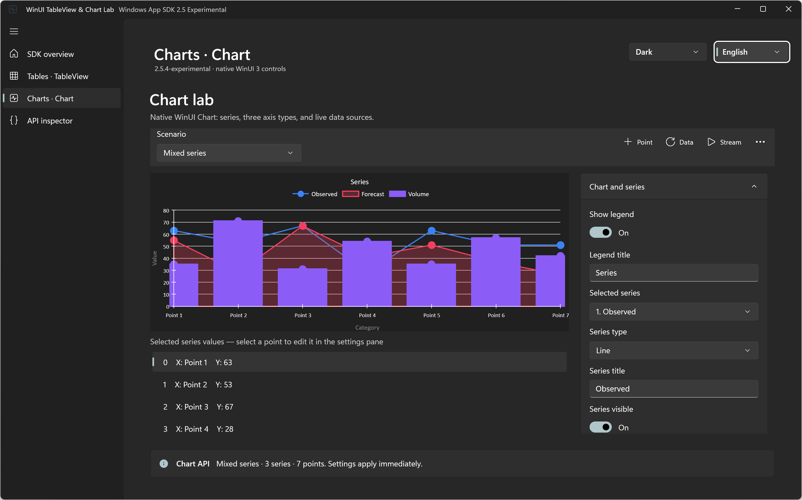
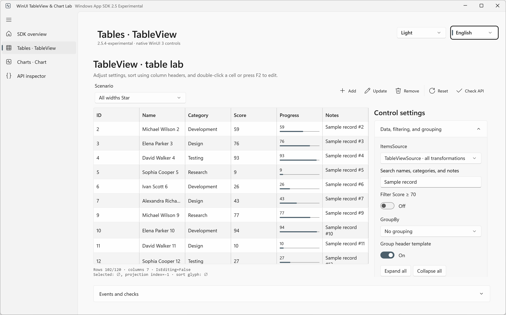
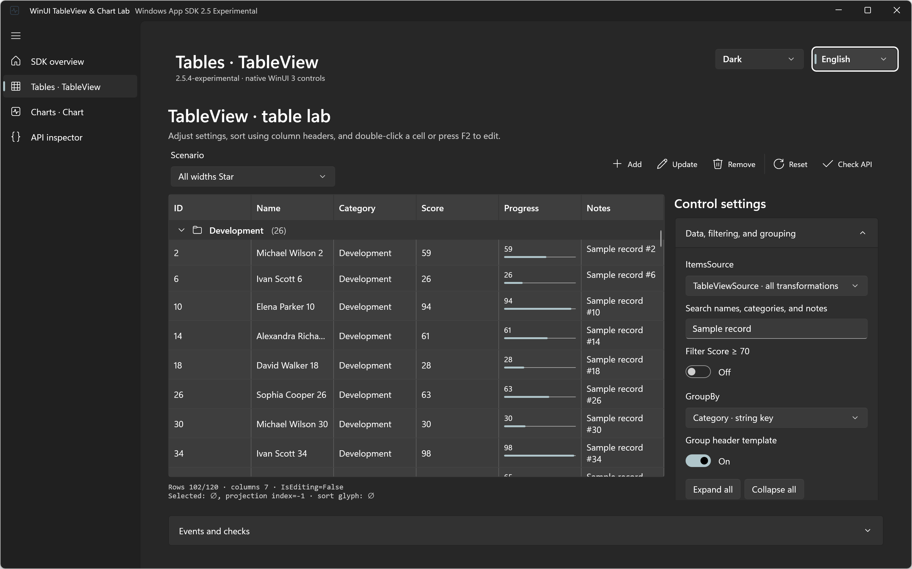
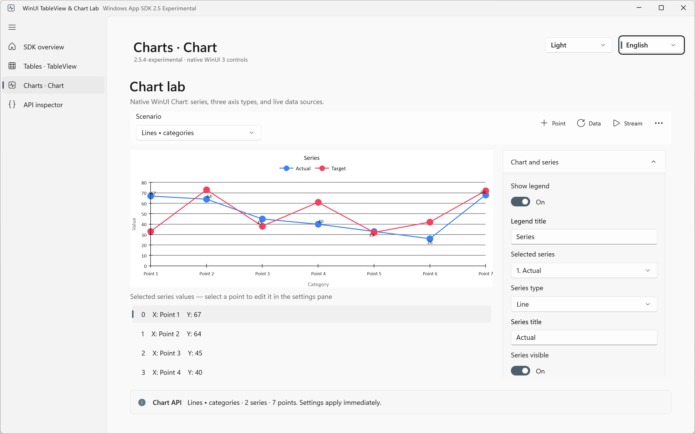
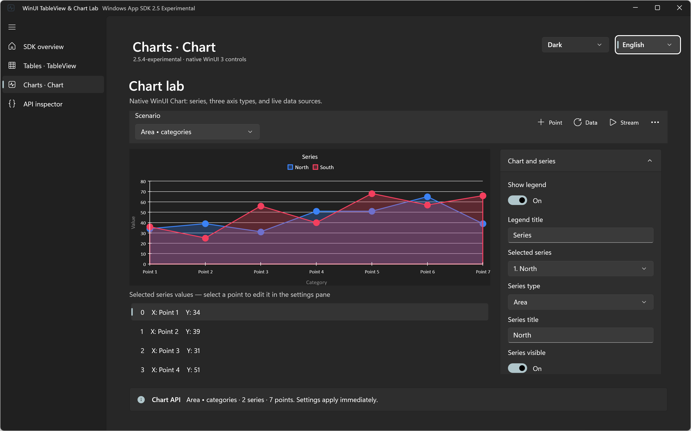
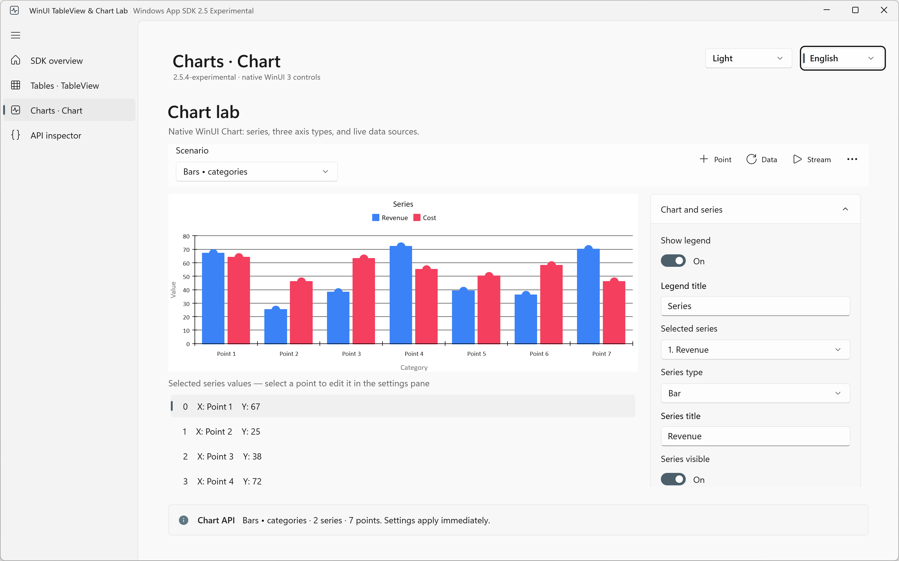
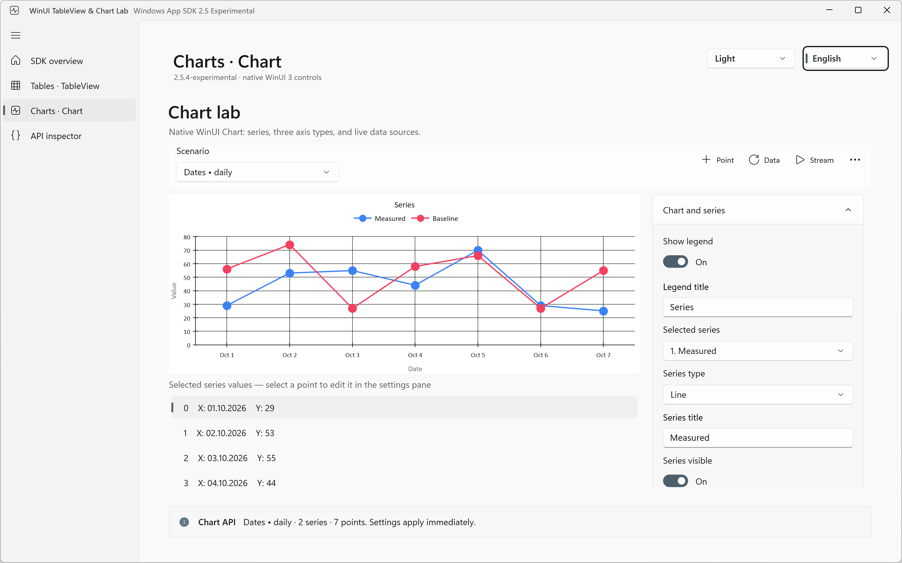
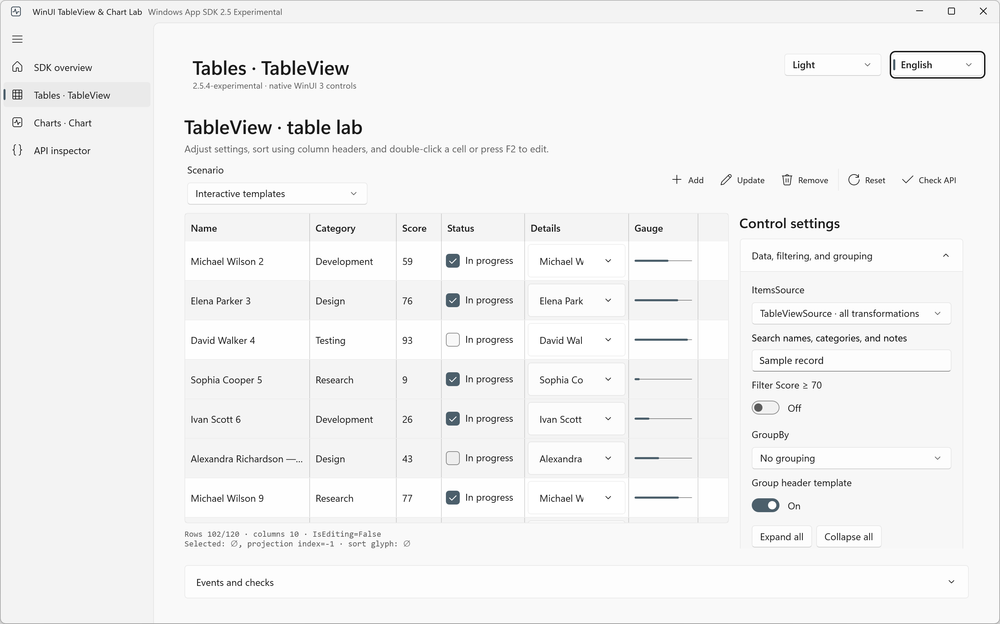
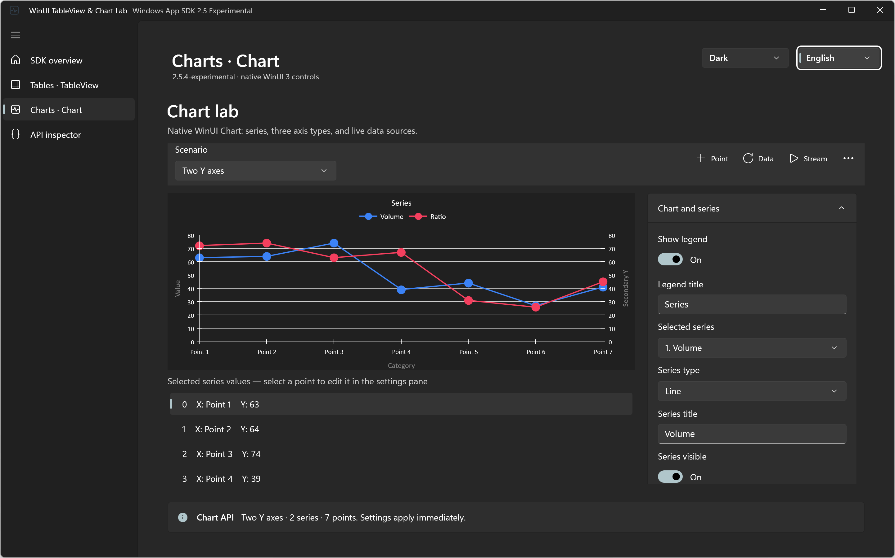
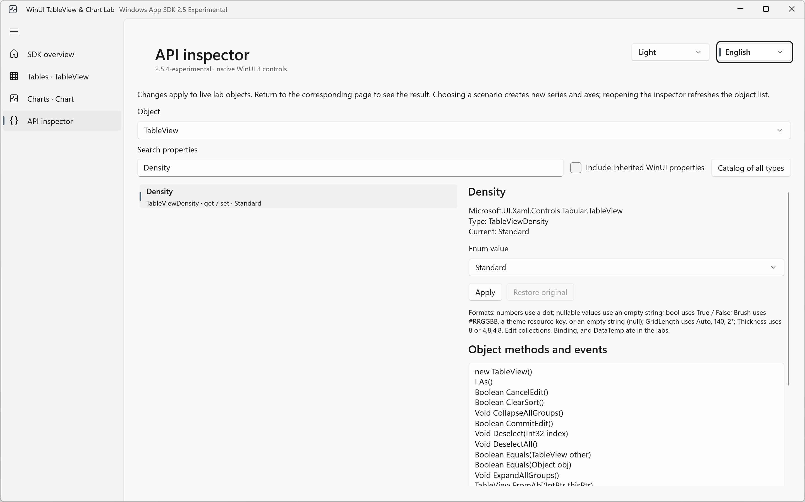

# WinUI TableView & Chart Lab

[](https://github.com/lawlabs/winui-tableview-chart-lab/actions/workflows/build.yml)
[](LICENSE)
[](https://www.nuget.org/packages/Microsoft.WindowsAppSDK/2.5.4-experimental)

An interactive **WinUI 3** sample for the new native **TableView** and **Chart** components in **Windows App SDK 2.5.4-experimental**. Explore tables, Cartesian charts, live data, editing, grouping, axes, and the public SDK API in a real C# / XAML desktop application.

**English is the first-run default.** Switch English/Russian in the window header; the choice is remembered. Primary documentation and screenshots are English. [Russian README / Русская документация](README.ru.md).

## Screenshots

Click any image to open the full-resolution PNG. These are real captures of the running English WinUI application with synthetic sample data.

<a href="docs/screenshots/chart-mixed-dark.png"></a>

*Native WinUI Chart in Dark: Line, Area, and Bar series share a categorical X axis and editable data sources.*

<table>
<tr>
<td width="50%"><a href="docs/screenshots/table-star-light.png"></a><p><b>TableView · Star sizing</b><br>Proportional columns, templates, and filtered rows.</p></td>
<td width="50%"><a href="docs/screenshots/table-grouped-dark.png"></a><p><b>TableView · Grouping</b><br>Category groups, themed headers, and expansion.</p></td>
</tr>
<tr>
<td width="50%"><a href="docs/screenshots/chart-lines-light.png"></a><p><b>Chart · Lines</b><br>Blue and coral lines with circle markers and numeric labels.</p></td>
<td width="50%"><a href="docs/screenshots/chart-area-dark.png"></a><p><b>Chart · Areas</b><br>Translucent blue and coral fills on readable dark axes.</p></td>
</tr>
<tr>
<td width="50%"><a href="docs/screenshots/chart-bars-light.png"></a><p><b>Chart · Bars</b><br>Native Revenue and Cost BarSeries with editable values.</p></td>
<td width="50%"><a href="docs/screenshots/chart-dates-light.png"></a><p><b>Chart · Dates</b><br>Real DateTimeAxis with English calendar labels.</p></td>
</tr>
<tr>
<td width="50%"><a href="docs/screenshots/table-interactive-light.png"></a><p><b>TableView · Interactive templates</b><br>Row checkboxes, expanders, and a custom gauge column.</p></td>
<td width="50%"><a href="docs/screenshots/chart-dual-axis-dark.png"></a><p><b>Chart · Two Y axes</b><br>Line series assigned to independent left and right axes.</p></td>
</tr>
</table>

<details>
<summary>API inspector screenshot</summary>
<p><a href="docs/screenshots/api-inspector-light.png"></a></p>
<p>Inspect real tables, charts, columns, series, axes, and Samples objects; export the type catalog.</p>
</details>

## Run the WinUI 3 sample

Use Windows with Developer Mode enabled, **.NET SDK 10.0.401**, and a working WinUI development environment with Windows SDK 10.0.26100.0. Visual Studio with WinUI/.NET desktop tooling is the easiest route. The verified configuration is **packaged x64 Debug**; other architectures and Release trimming have not been validated.

```powershell
git clone https://github.com/lawlabs/winui-tableview-chart-lab.git
cd winui-tableview-chart-lab
.\BuildAndRun.ps1
```

Or open `SdkComponentLab.slnx` in Visual Studio. The script restores dependencies, closes this sample's previous instance, builds, registers the development package, and launches the native window. Its NuGet dependency supplies **WinApp CLI 0.7.1**, without a global CLI update. Use `-Diagnostics` for attached launch diagnostics.

`WindowsAppSDKSelfContained=true` deploys new DLL/PRI resources. Experimental XAML `WMC1501` warnings are expected. The source project name remains `SdkComponentLab`; the displayed product name is **WinUI TableView & Chart Lab**.

## Explore TableView

| Area | Experiments |
| --- | --- |
| Scenarios | Mixed columns, Auto, Star, interactive templates, 10,000 rows, empty source |
| Data shaping | Filter/ClearFilter; property/computed/reference-identity groups; group templates; expand/collapse; column/path/delegate sorting; multiple source sort keys; custom comparer; sorting veto |
| Columns | Text/template/custom gauge; Width/Min/Max/ActualWidth; visibility; Leading frozen; live add/remove/reorder; header templates/selectors; tooltips |
| Editing | F2/double-click; Enter/Esc; CommitEdit/CancelEdit; begin/commit veto; Score validation; CellEditingTemplate |
| Selection | Single/None; Select/Deselect/DeselectAll/IsSelected; projection indices and selected model |
| Presentation | Density, grid lines, banding, headers, read-only gates, RTL, empty/group templates, event log |

Try **Score = -1 or 101**, edit Notes to compare Enter and Esc, sort using headers, and group by category. Settings scroll on the right; narrow windows place them below the table.

## Explore native WinUI charts

| Area | Experiments |
| --- | --- |
| Scenarios | Line, Area, Bar, mixed series, numeric categories, dates, two Y axes, horizontal bars, empty data, 200 points |
| Data | Add/remove/change points and series; selected-point editor; typed Samples sources; stream with a 30-point window |
| Series | Visibility, title, Stroke/Fill, thickness, dash styles, labels/markers and brushes, every MarkerShape, point overrides, Y-axis assignment |
| Axes | CategoryAxis sorting; LinearAxis Y ranges/spacing; DateTimeAxis formats/intervals/bounds; labels, ticks, lines, and grids |
| Appearance | Light/Dark/System; semantic WinUI brushes and vivid palette; fill alpha; dynamic theme resource refresh |

Additional Chart commands are in the toolbar's `...` menu. Changes reach live native objects. The app owns editable data and replaces Samples.ItemsSource with typed arrays after changes.

## Languages and API inspector

Select **English** or **Русский** in the header. Switching language reloads sample labs/data, preserving navigation and theme. Strings use matching MRT Core `.resw` resources, XAML `x:Uid`, and ResourceLoader; first-run English is independent of the OS display language.

The inspector searches live TableView/Chart properties, edits supported simple values, restores originals, and optionally includes inherited WinUI properties. Collections/templates are exercised through lab controls; methods/events are listed as signatures. The [exported public API catalog](docs/public-api.txt) contains **55 public types** from both namespaces.

## Research and release boundaries

This is an experimental SDK exploration sample. TableView currently supports Single selection and Leading frozen columns. Headers sort one column; source sorting can compose keys. Reorder buttons are sample behavior. Native Chart declares Cartesian Line/Area/Bar; pie/3D, stacking, and built-in zoom/pan are absent from this release API.

The tested SDK rejects LinearAxis on LineSeries.XAxis with `0x80070057`. Numeric X scenarios use equally spaced string categories and expose a separate restriction probe. LinearAxis Y and DateTimeAxis X work. Fill opacity is normalized into Color.A. Research notes distinguish published APIs from runtime observations.

- [SDK release overview and requirements](docs/sdk-release-notes.md)
- [Complete TableView API research and official sources](docs/table-research.md)
- [Complete Chart API research and official sources](docs/chart-research.md)
- [Verification: 79 passing UI/API checks](docs/verification.md)
- [Official Microsoft release notes](https://learn.microsoft.com/en-us/windows/apps/windows-app-sdk/release-notes/windows-app-sdk-2-0?pivots=experimental#version-25-experimental-254-experimental)

## Validate and contribute

```powershell
.\tests\repository-checks.ps1
.\tests\run-ui-tests.ps1 -AppPid <PID from BuildAndRun>
```

UI tests run sequentially against the existing window on an interactive Windows desktop. Generated development artifacts are ignored; curated English screenshots and recorded reports are in `docs/`. GitHub Actions checks resources/documentation and compiles the WinUI project on Windows.

See [CONTRIBUTING.md](CONTRIBUTING.md). Contributions to native WinUI TableView scenarios, Chart experiments, accessibility, localization, and documentation are welcome.

## License

[MIT](LICENSE). Microsoft Windows App SDK dependencies retain their own licenses. All sample records and chart values are synthetic.
